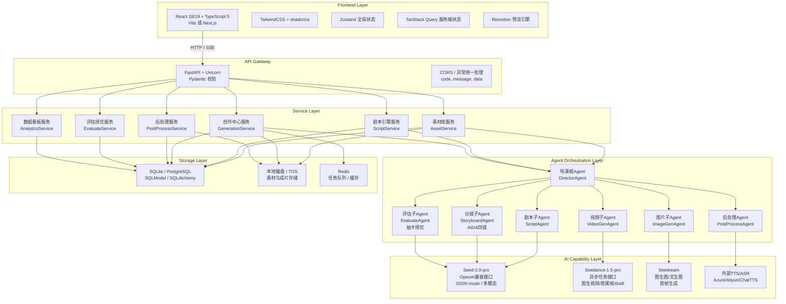
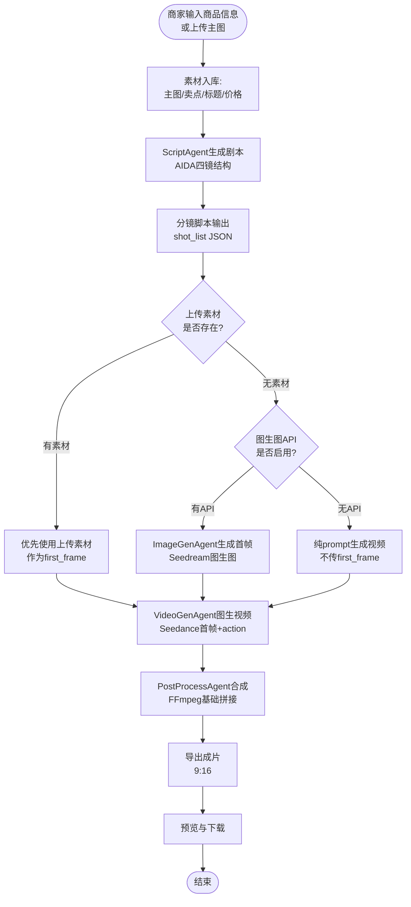
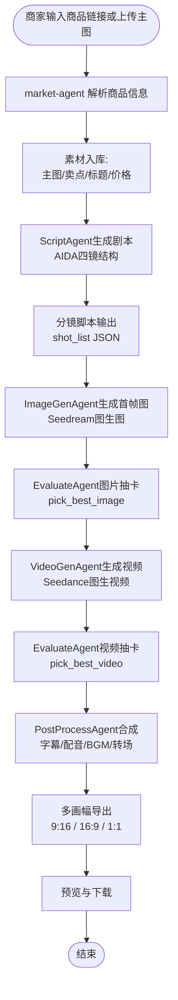
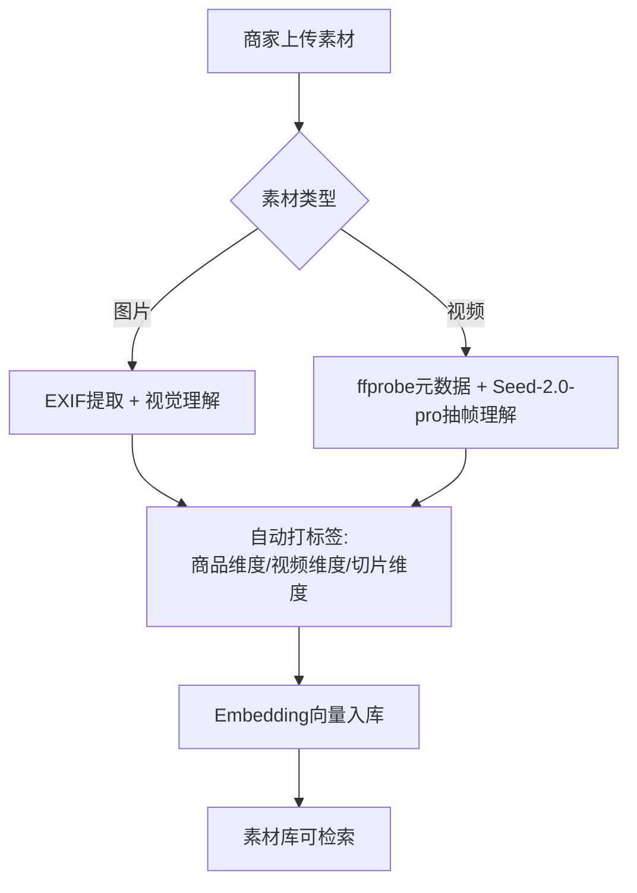
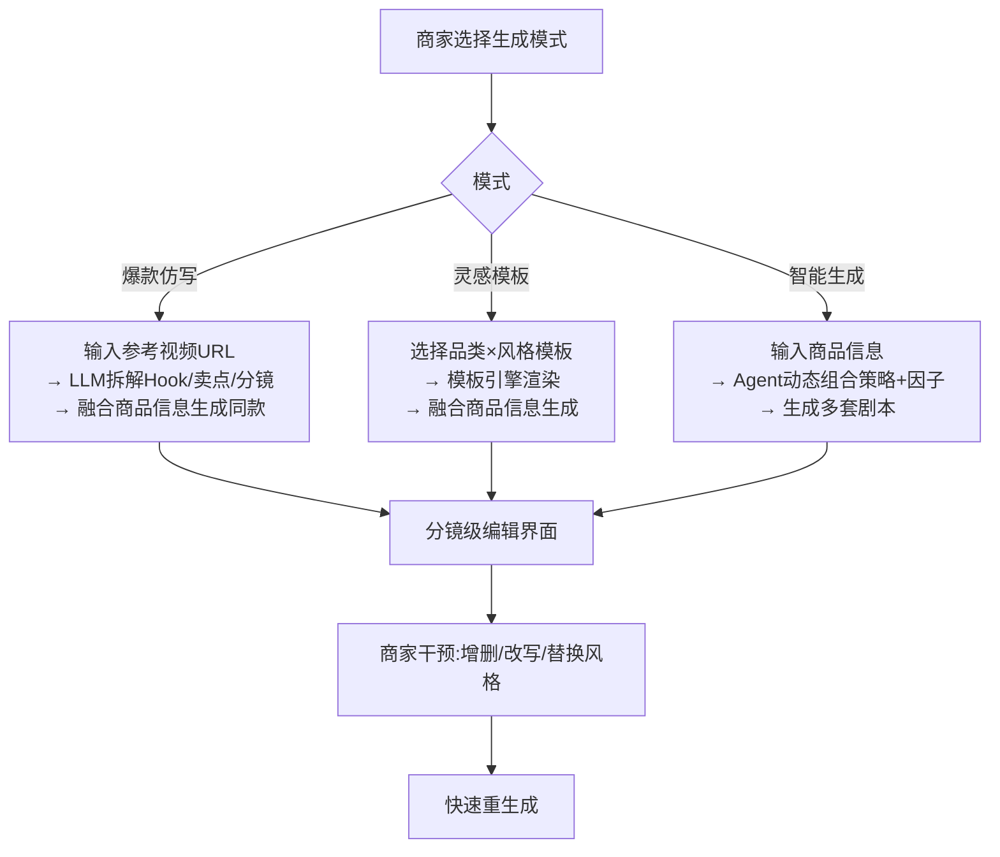
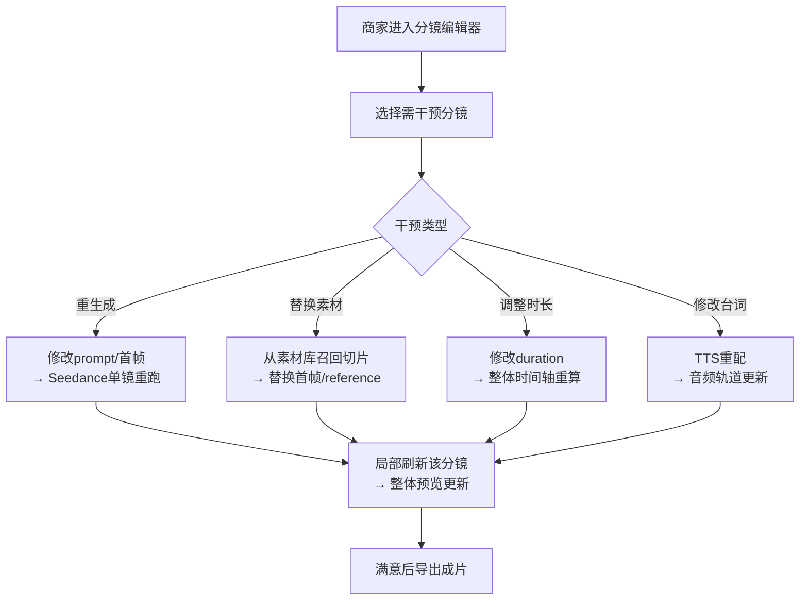
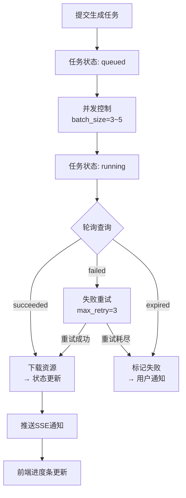
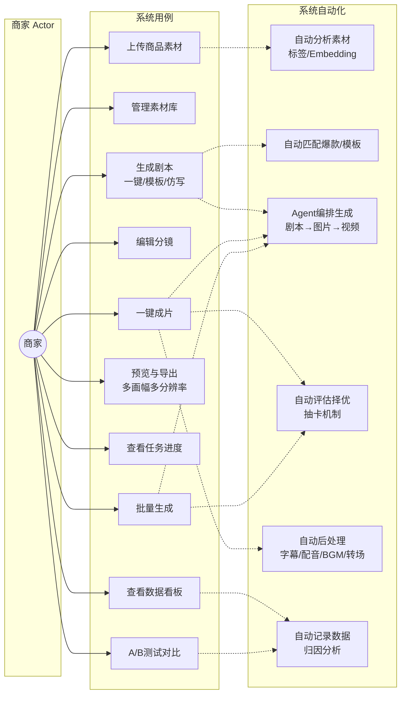

# ShopShot 系统架构设计（Python FastAPI 后端 + React 前端）

## 一、总体架构图



---

## 二、核心流程图

### 2.1 一键成片主流程（P0）



### 2.2 一键成片完整流程（P0 + P1）



### 2.3 素材入库与结构化流程（P0/P1）



### 2.4 剧本生成三模式流程（P0/P1）



### 2.5 分镜干预与快速重渲染流程（P1）



### 2.6 异步任务调度与长任务体验流程（P0/P1）



---

## 三、用例图



---

## 四、项目目录树

```
shopshot/
├── README.md                          # 项目说明与启动方式
├── .env.example                       # 环境变量模板
├── docker-compose.yml                 # P2: Docker一键部署前后端
│
├── backend/                           # Python FastAPI 后端（核心）
│   ├── app/
│   │   ├── __init__.py
│   │   ├── main.py                    # FastAPI 应用入口
│   │   ├── config.py                  # Pydantic Settings 配置管理（含 IMAGE_GENERATION_ENABLED / SEEDANCE_API_KEY / SEEDREAM_API_KEY 等开关）
│   │   ├── dependencies.py            # FastAPI Dependencies（get_db, get_redis等）
│   │   │
│   │   ├── api/                       # API 路由层（Jellyfish FastAPI模式）
│   │   │   ├── __init__.py
│   │   │   ├── v1/
│   │   │   │   ├── __init__.py
│   │   │   │   ├── assets.py          # GET/POST/DELETE 素材CRUD + 上传
│   │   │   │   ├── assets_analyze.py  # POST /assets/{id}/analyze: AI分析素材
│   │   │   │   ├── scripts.py         # 剧本CRUD + POST /generate + POST /regenerate
│   │   │   │   ├── shots.py           # 分镜CRUD + POST /{id}/generate
│   │   │   │   ├── generations.py     # 生成任务中心（提交/状态/结果/取消）
│   │   │   │   ├── videos.py          # 成片合成 + 多画幅导出
│   │   │   │   ├── agents.py          # POST /run: 触发Multi-Agent工作流
│   │   │   │   ├── batch.py           # POST /batch/generate: 批量生成多版视频
│   │   │   │   ├── analytics.py       # GET: Mock数据看板
│   │   │   │   └── tts.py             # POST: 文本转语音
│   │   │   └── deps.py                # 通用依赖
│   │   │
│   │   ├── services/                  # 资源托管与状态服务层（Agent 不直接操作 DB，通过 Service 读写）
│   │   │   ├── __init__.py
│   │   │   ├── asset_service.py       # 素材库 CRUD + 文件存取（AI 分析由 Agent 调用）
│   │   │   ├── script_service.py      # 剧本/模板 CRUD（LLM 生成在 ScriptAgent）
│   │   │   ├── generation_service.py  # 异步任务状态机（提交/轮询/重试/进度更新）
│   │   │   ├── video_service.py       # 成片文件管理 + FFmpeg 命令执行（合成策略在 PostProcessAgent）
│   │   │   ├── market_service.py      # P1: MarketAgent 商品URL抓取与卖点提炼服务
│   │   │   └── analytics_service.py   # 数据看板聚合（Mock 数据生成）
│   │   │
│   │   ├── agents/                    # Agent编排层（Python LangChain/LangGraph）
│   │   │   ├── __init__.py
│   │   │   ├── director.py            # DirectorAgent: 根调度Agent
│   │   │   ├── script_agent.py        # ScriptAgent: 剧本生成
│   │   │   ├── storyboard_agent.py    # StoryboardAgent: AIDA分镜设计
│   │   │   ├── image_agent.py         # ImageGenAgent: Seedream图生图
│   │   │   ├── video_gen_agent.py     # VideoGenAgent: Seedance图生视频
│   │   │   ├── evaluate_agent.py      # EvaluateAgent: GEval打分抽卡择优
│   │   │   ├── postprocess_agent.py   # PostProcessAgent: 合成/字幕/配音/BGM
│   │   │   ├── release_agent.py       # P2: ReleaseAgent 成片发布与数据回流
│   │   │   └── compliance_node.py     # P2: ComplianceNode 合规审核节点（LangGraph 嵌入）
│   │   │
│   │   ├── models/                    # 数据模型（SQLModel = Pydantic + SQLAlchemy）
│   │   │   ├── __init__.py
│   │   │   ├── project.py             # Project模型
│   │   │   ├── asset.py               # Asset模型
│   │   │   ├── script.py              # Script模型
│   │   │   ├── shot.py                # Shot模型
│   │   │   ├── generation_task.py     # GenerationTask模型（异步任务中心）
│   │   │   ├── video.py               # Video模型
│   │   │   ├── template.py            # ScriptTemplate模型
│   │   │   └── analytics.py           # Analytics模型（Mock数据）
│   │   │
│   │   ├── schemas/                   # Pydantic Schema（请求/响应校验）
│   │   │   ├── __init__.py
│   │   │   ├── asset.py
│   │   │   ├── script.py
│   │   │   ├── shot.py
│   │   │   ├── generation.py
│   │   │   ├── video.py
│   │   │   └── common.py              # ApiResponse包装 / Pagination
│   │   │
│   │   ├── core/                      # 核心基础设施
│   │   │   ├── __init__.py
│   │   │   ├── database.py            # SQLModel引擎 + AsyncSession管理
│   │   │   ├── task_manager.py        # 异步任务中心（Jellyfish模式Python版）
│   │   │   ├── storage.py             # 文件存储抽象（本地磁盘 / TOS）
│   │   │   ├── celery_app.py          # Celery配置（P1: Redis队列）
│   │   │   └── exceptions.py          # 自定义HTTP异常
│   │   │
│   │   ├── utils/                     # 工具函数
│   │   │   ├── __init__.py
│   │   │   ├── seedance_client.py     # Seedance API封装（异步HTTP + 轮询）
│   │   │   ├── seed_client.py         # Seed-2.0-pro OpenAI兼容客户端
│   │   │   ├── ffmpeg_utils.py        # FFmpeg命令封装（拼接/转码/多画幅）
│   │   │   ├── moviepy_render.py      # MoviePy三层合成（Track→Shot→Clip）
│   │   │   ├── tts_provider.py        # TTS多提供商统一抽象（Azure/Aliyun/ChatTTS）
│   │   │   ├── media_probe.py         # ffprobe/librosa媒体分析
│   │   │   ├── prompt_templates.py    # Prompt工程模板库（AIDA/运镜/风格）
│   │   │   ├── scraper.py             # P1: Playwright商品/视频页面抓取工具
│   │   │   └── validators.py          # 校验器
│   │   │
│   │   ├── prompts/                   # 系统提示词（纯Python字符串模板）
│   │   │   ├── __init__.py
│   │   │   ├── director_prompts.py    # 导演Agent提示词
│   │   │   ├── aida_storyboard.py     # AIDA分镜提示词（ad-video-gen复刻）
│   │   │   ├── video_generation.py    # Seedance视频生成提示词模板
│   │   │   └── asset_analysis.py      # 素材分析提示词
│   │   │
│   │   ├── compliance/                # P2: 合规审核与风控
│   │   │   ├── __init__.py
│   │   │   ├── text_auditor.py        # 文案合规：极限词/虚假宣传/违禁词
│   │   │   ├── image_auditor.py       # 图片合规：敏感画面/水印检测
│   │   │   ├── video_auditor.py       # 视频合规：帧级抽检+黑边闪屏检测
│   │   │   └── rule_engine.py         # 规则引擎+LLM双审逻辑
│   │   │
│   │   └── observability/             # P2: 可观测性
│   │       ├── __init__.py
│   │       ├── middleware.py          # FastAPI Trace中间件
│   │       ├── metrics.py             # Prometheus指标暴露
│   │       └── logging_config.py      # Structlog结构化日志配置
│   │
│   ├── alembic/                       # Alembic数据库迁移
│   │   ├── env.py
│   │   ├── versions/
│   │   └── script.py.mako
│   │
│   ├── tests/                         # Pytest测试
│   │   ├── conftest.py
│   │   ├── test_api/
│   │   ├── test_agents/
│   │   └── test_services/
│   │
│   ├── scripts/                       # 后端工具脚本
│   │   ├── test_seedance.py           # Seedance API连通性测试
│   │   ├── test_seed.py               # Seed-2.0-pro测试
│   │   └── init_db.py                 # 数据库初始化 + 模板种子数据
│   │
│   ├── requirements.txt
│   ├── pyproject.toml                 # Poetry / PDM配置
│   └── Dockerfile                     # 后端Docker镜像
│
├── frontend/                          # React + TypeScript 前端
│   ├── src/
│   │   ├── app/                       # React Router 或 Next.js App Router
│   │   │   ├── page.tsx               # 首页/项目列表（Dashboard）
│   │   │   ├── layout.tsx             # 根布局
│   │   │   ├── projects/
│   │   │   │   └── page.tsx           # 项目列表
│   │   │   ├── project/
│   │   │   │   └── [id]/
│   │   │   │       ├── page.tsx       # 项目工作台总览
│   │   │   │       ├── assets/
│   │   │   │       │   └── page.tsx   # 素材库管理页
│   │   │   │       ├── script/
│   │   │   │       │   └── page.tsx   # 剧本生成与编辑页
│   │   │   │       ├── storyboard/
│   │   │   │       │   └── page.tsx   # 分镜编辑器页（时间轴+列表）
│   │   │   │       ├── video/
│   │   │   │       │   └── page.tsx   # 视频预览与合成配置页
│   │   │   │       ├── export/
│   │   │   │       │   └── page.tsx   # 导出页（多画幅/分辨率）
│   │   │   │       └── settings/
│   │   │   │           └── page.tsx   # 项目设置
│   │   │   ├── batch/
│   │   │   │   └── page.tsx           # 批量生成页
│   │   │   ├── tasks/
│   │   │   │   └── page.tsx           # 任务中心页（全局进度看板）
│   │   │   └── analytics/
│   │   │       └── page.tsx           # 数据看板页
│   │   │
│   │   ├── components/                # React组件
│   │   │   ├── ui/                    # shadcn/ui 基础组件
│   │   │   ├── layout/                # 布局（Header/Sidebar/Footer）
│   │   │   ├── common/
│   │   │   │   └── Stepper.tsx        # 一键成片步骤引导（adgen Stepper模式）
│   │   │   ├── assets/
│   │   │   │   ├── AssetUploader.tsx
│   │   │   │   ├── AssetGrid.tsx
│   │   │   │   └── AssetTagEditor.tsx
│   │   │   ├── script/
│   │   │   │   ├── ScriptGenerator.tsx
│   │   │   │   ├── ScriptEditor.tsx
│   │   │   │   └── TemplateSelector.tsx
│   │   │   ├── storyboard/
│   │   │   │   ├── ShotList.tsx
│   │   │   │   ├── Timeline.tsx
│   │   │   │   ├── ShotEditor.tsx
│   │   │   │   ├── ShotVariantPicker.tsx  # P1: EvaluateAgent抽卡结果展示与择优UI
│   │   │   │   └── RemotionPreview.tsx
│   │   │   ├── video/
│   │   │   │   ├── VideoPlayer.tsx
│   │   │   │   ├── ComposeSettings.tsx
│   │   │   │   └── ExportOptions.tsx
│   │   │   ├── tasks/
│   │   │   │   ├── TaskList.tsx
│   │   │   │   ├── TaskProgress.tsx
│   │   │   │   └── TaskStatusBadge.tsx
│   │   │   └── analytics/
│   │   │       ├── ConversionChart.tsx
│   │   │       └── FactorAttribution.tsx
│   │   │
│   │   ├── lib/                       # 前端工具库
│   │   │   ├── api.ts                 # API客户端（axios/fetch封装，对接FastAPI）
│   │   │   ├── store/                 # Zustand状态管理
│   │   │   │   ├── projectStore.ts
│   │   │   │   ├── assetStore.ts
│   │   │   │   ├── scriptStore.ts
│   │   │   │   ├── shotStore.ts       # 分镜状态（增删改+变体选择）
│   │   │   │   ├── generationStore.ts
│   │   │   │   └── editorStore.ts
│   │   │   └── utils.ts
│   │   │
│   │   ├── types/                     # TypeScript类型定义
│   │   │   ├── project.ts
│   │   │   ├── asset.ts
│   │   │   ├── script.ts
│   │   │   ├── shot.ts
│   │   │   ├── generation.ts
│   │   │   └── analytics.ts
│   │   │
│   │   └── hooks/
│   │       ├── useGenerationTask.ts   # 任务轮询Hook（TanStack Query）
│   │       ├── useSSE.ts              # SSE实时进度Hook
│   │       └── useDragAndDrop.ts      # 拖拽Hook（分镜编辑器）
│   │
│   ├── public/
│   ├── package.json
│   ├── vite.config.ts / next.config.js
│   ├── tsconfig.json
│   └── Dockerfile
│
├── outputs/                           # 本地输出目录（gitignore）
│   ├── api_results/
│   ├── videos/
│   └── temp/
│
├── .github/                           # P2: CI/CD
│   └── workflows/
│       ├── ci.yml                     # 后端测试+Lint+构建
│       └── cd.yml                     # Docker镜像推送+部署
│
└── nginx/                             # P2: Nginx反向代理配置
    └── default.conf
```

---

## 五、以 Agent 协作为核心的模块拆解

> **核心设计原则**：参考 ad-video-gen 的 VeADK 架构，**创作逻辑全部由 Agent 负责，Service 层只托管资源、状态和底层工具**。P0 即建立 Agent 骨架（顺序执行），P1 丰富 Agent 能力（评估抽卡、链式续拍），P2 升级为状态机（LangGraph + Hook）。

### P0 / P1 / P2 分阶段交付总览

| 阶段 | 核心目标 | 包含模块（详细设计章节） |
|---|---|---|
| **P0 必做** | **Agent 顺序调度跑通**：Director → Script → Video → PostProcess，全流程可点通。P0 不是空壳，每个 Agent 都含完整 LLM 调用 + 格式化校验 | 5.1（Agent 编排骨架）+ 5.2（素材库）+ 5.3（任务状态） |
| **P1 进阶** | **Agent 能力增强**：EvaluateAgent 抽卡、链式续拍、样片模式、模板矩阵、素材 AI 分析、字幕/配音/BGM、多画幅、Mock 看板 | 5.1（EvaluateAgent / 链式 / draft）+ 5.4（剧本模板）+ 5.5（后处理增强）+ 5.6（数据看板） |
| **P2 加分** | **Agent 智能化**：LangGraph 状态机、Hook 容错、合规节点、A/B 实验、可观测性、Docker / CI/CD | 5.1（LangGraph / Hook）+ 5.7（合规节点）+ 5.8（可观测 / DevOps） |

### 5.1 Agent 编排与创作中心（P0 核心 / P1 / P2）

系统的**唯一创作引擎**。参考 ad-video-gen `director-agent` 根调度 + `SequentialAgent` 串联模式。

**P0 实现（顺序执行骨架）**：DirectorAgent 按固定顺序调用子 Agent，每个子 Agent = LLM 生成 + 格式化输出。不依赖复杂框架，用 Python async 函数 + Pydantic Schema 即可。**注意：P0 不是"空壳"，每个 Agent 都包含完整的创作逻辑（LLM 调用、工具执行、格式化校验），Service 层只负责资源存取，绝不介入创作决策。**

| Agent / 节点 | 职责 | P0 | P1 | P2 |
|---|---|---|---|---|
| **DirectorAgent** | 识别意图，调度子 Agent 执行 | 硬编码顺序调度 | 支持条件分支（如审核失败重跑） | LangGraph `StateGraph` |
| **ScriptAgent** | 生成 AIDA 剧本 + 分镜 | `SequentialAgent`：Storyboard → Format | 增加模板矩阵、爆款仿写 | 因子级动态组合 |
| **ImageGenAgent** | 分镜首帧图生成 | **可选**：优先使用上传素材；有API时生成首帧；无API时跳过 | 批量生成 N 版供抽卡 | 风格一致性控制 |
| **VideoGenAgent** | 图生视频 | 单镜顺序生成 | **链式续拍**（首尾帧衔接） | draft 样片模式 |
| **EvaluateAgent** | 质量评估择优 | — | **GEval 打分 + pick_best** | 多维度动态权重 |
| **PostProcessAgent** | 合成/字幕/配音/BGM | FFmpeg concat 基础拼接 | 字幕 burn + TTS + BGM | MoviePy 复杂转场 |
| **MarketAgent** | 解析商品 URL，提炼卖点与 video_config | — | Playwright 抓取 + Seed-2.0-pro 分析 | 接入导演 Agent 调度 |
| **ReleaseAgent** | 成片合成发布、多平台分发 | — | — | Mock 发布 + 数据回流 |
| **ComplianceNode** | 内容合规审核 | — | — | 嵌入链路的审核节点 |

**关键实现路径（Python）：**
- P0 DirectorAgent：`app/agents/director.py` → `async def run(project_id)` → 顺序 `await script_agent.run()` → 【可选】`await image_agent.run()`（判断 `settings.IMAGE_GENERATION_ENABLED` + 上传素材是否存在：无API且有素材则跳过，直接注入素材URL；无API且无素材则生成纯prompt视频）→ `await video_gen_agent.run()` → `await postprocess_agent.run()`
- P0 ScriptAgent（SequentialAgent 模式）：`app/agents/script_agent.py` → `storyboard_node`（LLM 生成 AIDA 四镜）→ `format_node`（Pydantic `ShotList` Schema 校验 + `fix_output_format`，**复刻 ad-video-gen `output_schema=ShotList` + `output_key="shot_list"` 约束模式**）→ 输出标准 JSON
- P1 EvaluateAgent：`app/agents/evaluate_agent.py` → 对同一 shot 生成 `n_variants=4` → `evaluate_media()` GEval 多维度打分（视觉质量 visual_quality、运动流畅度 motion_smoothness、商品主体完整度 product_presence、文字清晰度 text_legibility、色彩一致性 color_consistency）→ `pick_best()` 按动态权重选最高分 → 更新 `Shot.generated_video_asset_id` 与 `variant_index`
- P0 VideoGenAgent fallback：`app/agents/video_gen_agent.py` → 读取 shot `reference_asset_id` / `image_prompt` → 若存在上传素材则直接用素材 URL 作为 `first_frame`（P1 支持同时指定 `last_frame` 退场画面）；若 `IMAGE_GENERATION_ENABLED=false` 且无素材则只传 `action_prompt`（纯 prompt 生成，**Prompt 统一用英文，商品特征词置于前部，避免负面 prompt 与复杂多动作堆叠**）；若启用 API 则调用 ImageGenAgent 输出 URL 作为 `first_frame` → `seedance_client.py` 组装 payload → 提交异步任务
- P1 链式续拍：`app/agents/video_gen_agent.py` → for 循环生成 shots → 每镜 `return_last_frame=true` → 下载尾帧 → 注入下一镜 `first_frame`（尾帧衔接前需保证所有首帧图比例一致，避免 Seedance 居中裁剪导致商品漂移）
- P2 LangGraph + Hook 容错：`app/agents/director.py` → `StateGraph` 定义节点和边 → 节点间传递 `AgentState`；同时引入 ad-video-gen 的 **Hook 机制** —— `after_tool_callback`（工具调用后检查错误、长 URL 缩短）与 `after_model_callback`（模型输出后修复 JSON 格式、校验 Schema），作为可插拔中间件嵌入每个 Agent 节点
- P2 ReleaseAgent（发布）：`app/agents/release_agent.py` → 成片多平台发布模拟（Mock 发布链接获取 → 数据回流）

**P0 与 VeADK 的映射关系：** P0 的 Python async 顺序执行并非"自创框架"，而是 ad-video-gen `VeADK A2A Multi-Agent` 的轻量级 Python 复刻 —— `DirectorAgent` 对应根 Agent 调度，`storyboard_node + format_node` 对应 `SequentialAgent` 串联，`seedance_client.py` 对应视频生成工具，`fix_output_format` 对应 `after_model_callback` Hook。P2 再正式迁移到 LangGraph `StateGraph`。

**借鉴来源：** ad-video-gen `director-agent/agent.py`, `story_sequential_agent`, `evaluate-agent`, `hook/`；video-cut-agent `create_agent()`

### 5.2 素材库模块（P0 必做）

Service 层职责：**资源托管 + 元数据管理**。创作逻辑（标签提取、向量化）由 Agent 调用，Service 只负责存取。

| 子模块 | 功能 | 技术选型 | 借鉴来源 |
|---|---|---|---|
| 素材上传 | 图片/视频/音频上传 → 本地磁盘或 TOS | FastAPI `UploadFile` + `app/core/storage.py` | jellyfish 文件上传路由 |
| 素材预处理 | **按目标画幅比例裁剪/填充**，避免 Seedance 居中裁剪导致商品主体被切 | `Pillow` `ImageOps.fit(pad)` 或 FFmpeg `pad` | seedance-chain 踩坑记录 |
| 元数据提取 | 图片 EXIF、视频 ffprobe、音频码率采样率 | `Pillow` + `subprocess(ffprobe)` + `mutagen` | video-cut-agent `image/video/audio_basic_analysis_tool` |
| AI 内容理解 | 抽帧 → Seed-2.0-pro 多模态理解 → 自动标签 | fps=1 抽帧 + base64 + `response_format={"type":"json_object"}` | ai-app-lab `video_analyser` |
| 结构化标签 | 商品维度 / 视频维度 / 切片维度 | Pydantic `AssetAnalysis` Schema → 入库 `asset.analysis` | jellyfish 资产一致性管理 |
| 素材召回 | 文本检索 + 向量相似度（P1） | `sqlite-vec` / `pgvector` + 人工标签 | video-cut-agent 素材匹配 |
| **资产 ID 引用原则** | 分镜脚本**只存资产 ID**，不存图片本身；生成时按 ID 召回 URL/base64 | `Shot.reference_asset_id` → `Asset.url` | jellyfish 资产一致性管理 |

**关键实现路径（Python）：**
- 上传 API：`app/api/v1/assets.py` → `POST /upload` → `storage.py` 保存文件 → `AssetService` 写入 SQLModel → 返回 `AssetRead`
- AI 分析：`app/api/v1/assets_analyze.py` → `POST /assets/{id}/analyze` → `media_probe.py` 提取元数据 → `seed_client.py` 多模态理解 → 更新 `asset.analysis` JSON
- 素材供 Agent 消费：`AssetService.get_by_tags(project_id, tags)` → DirectorAgent / ScriptAgent 调用

### 5.3 任务调度与状态机（P0 必做）

Service 层职责：**状态托管 + 进度推送 + 失败重试**。Agent 只负责生成内容，不感知任务持久化。

| 子模块 | 功能 | 技术选型 | 借鉴来源 |
|---|---|---|---|
| 任务状态机 | queued → running → succeeded / failed / expired / cancelled | SQLModel `GenerationTask` + FastAPI 轮询 | jellyfish `task_status.py` |
| 进度追踪 | 实时展示生成进度（%） | FastAPI SSE → 前端 TanStack Query | adgen `useStore`, daihuo-jianshou `video/page.tsx` |
| 并发控制 | 单账号 Seedance 并发限制保护 | `asyncio.Semaphore(3)` + `aiohttp` | seedance-chain `BATCH_SIZE=2` |
| 失败重试 | 自动重试 3 次，指数退避 | 自定义 `retry` decorator / Celery `autoretry_for`（P1） | 比赛 P1 要求 |
| 断点续传 | 大素材上传断点续传 | `python-tusserver` 或分片上传（P1） | 比赛 P1 要求 |
| 任务看板 | 全局任务列表、筛选、取消 | FastAPI 分页接口 + 前端 TanStack Query | jellyfish `list_tasks()` |

**关键实现路径（Python）：**
- 任务表：`app/models/generation_task.py` → SQLModel `GenerationTask`（id, status, type, payload, result, error, progress, retry_count, parent_task_id, executor_task_id, agent_name, step, started_at, finished_at, created_at, updated_at）
- 轮询接口：`app/api/v1/generations.py` → `GET /{task_id}/status` → 查询 SQLModel → 返回 `GenerationTaskRead`
- SSE 进度推送：`app/api/v1/generations.py` → `async def event_stream(task_id)` → `yield f"data: {json.dumps({'progress': 50})}\n\n"`
- Agent 不直接操作任务表：Agent 输出通过 `DirectorAgent` 回调 `TaskService.update_progress()`，解耦创作逻辑与状态持久化

**P1 单镜级状态追踪（Shot Status）**：除全局 `GenerationTask` 外，`Shot` 表自带 `status` 状态机（`pending → image_generating → image_completed → video_generating → video_completed → evaluating → evaluated`）。前端分镜编辑器可实时展示每镜的生成/评估状态，商家无需等待全局任务完成即可干预已完成的单镜。

### 5.4 剧本与模板引擎（P0 硬编码 / P1 智能化）

**P0**：ScriptAgent 内部用 Python 字符串模板硬编码 AIDA 框架，直接调用 Seed-2.0-pro 生成 `ShotList` JSON。无需外部模板表即可跑通。
**P1**：引入 `ScriptTemplate` 表 + 爆款仿写 + 方法论提炼，Agent 动态选择模板并融合商品信息。

| 子模块 | 功能 | 技术选型 | 借鉴来源 |
|---|---|---|---|
| **视频模式选择** | **P0 商家先选模式**：商品特写 / 图文混剪 / 场景演示 / 真人出镜（后两者 P1） | `Project.video_mode` + `target_platform` + `language` → 注入 ScriptAgent 作为生成策略 | daihuo-jianshou 4 大视频模式 |
| AIDA 分镜 | P0 固定 4 镜：Attention / Interest / Desire / Action | Python 字符串模板 + `prompt_templates.py` | ad-video-gen `PROMPT_STORYBOARD_AGENT` |
| 剧本生成 Agent | SequentialAgent：Storyboard → Format | `script_agent.py` → `storyboard_node` + `format_node` | ad-video-gen `story_sequential_agent` |
| 灵感模板 | P1 品类×风格矩阵 → 模板引擎渲染 | `ScriptTemplate` SQLModel 表 + Jinja2 | daihuo-jianshou 模板矩阵 |
| 爆款仿写 | P1 输入参考视频 URL → 拆解 Hook/卖点/分镜 → 融合商品 | Playwright + Seed-2.0-pro 长文本分析 | adgen `scrape/route.ts`, ai-app-lab `deep_research` |
| 方法论提炼 | P1 爆款视频聚类 → 策略+因子提取 | Seed-2.0-pro + `sklearn` 聚类 | ai-app-lab `deep_research` |
| 剧本干预 | 增删分镜、改写台词、替换因子 | FastAPI PUT + 前端表单 + 重跑指定 Agent | ad-video-gen 导演根 Agent 调度 |
| 因子级动态组合 | P2 按商品属性自动组合卖点因子 | LangGraph 条件节点 | daihuo-jianshou 因子归因思路 |

**关键实现路径（Python）：**
- P0 剧本 Agent：`app/agents/script_agent.py` → `storyboard_node`：拼接 `aida_storyboard.py` 模板 + 商品信息 → `seed_client.py` `response_format={"type":"json_object"}` → `format_node`：Pydantic `ShotList` 校验 + `fix_output_format` → 入库
- P1 模板引擎：`app/services/script_service.py` → 查询 `ScriptTemplate` 表 → Jinja2 渲染 → 注入 ScriptAgent 作为 system prompt 片段
- P1 爆款仿写：`app/utils/scraper.py` → Playwright 抓取 → `seed_client.py` 拆解 `{hook, selling_point, shot_breakdown, style, bgm_mood}` → ScriptAgent 融合生成

### 5.5 后处理与成片导出（P0 基础 / P1 增强）

Service 层职责：**资源托管（文件路径管理）+ 工具调用（FFmpeg 命令执行）**。拼接策略、字幕文案、BGM 选择由 PostProcessAgent 决定，Service 只负责执行。

| 子模块 | 功能 | 技术选型 | 借鉴来源 |
|---|---|---|---|
| 基础拼接 | P0 多镜顺序合成；**若各段编码参数一致可用 `-c copy` 无损极速合并** | FFmpeg concat demuxer（主）+ MoviePy（备选） | seedance-chain, video-cut-agent |
| 字幕叠加 | P1 口播文案 → SRT / 硬字幕 | FFmpeg `drawtext` filter 或 MoviePy `TextClip` | video-cut-agent `_create_text_clip()` |
| TTS 配音 | P1 文案 → 语音 → 混音；**长文本先拆句再逐句合成后拼接** | `TTSProvider` 抽象 → Azure/Aliyun/ChatTTS | moneyprinterplus 多提供商 TTS |
| BGM 混音 | P1 背景音 + 配音多轨混合；**需统一各段音频采样率避免 concat 后不同步** | FFmpeg `amix` / MoviePy `CompositeAudioClip` | video-cut-agent `_create_audio_clip()` |
| 多画幅导出 | P1 9:16 / 16:9 / 1:1 / 3:4 | FFmpeg `scale` + `pad` / `crop` | seedance-chain, daihuo-jianshou |
| 转场特效 | P2 镜头间过渡 | MoviePy `_apply_transition()` | video-cut-agent |
| 踩点剪辑 | P2 BGM 节拍对齐分镜切换 | librosa `beat_track` | video-cut-agent `audio_beat_analysis_tool` |

**关键实现路径（Python）：**
- P0 合成：`app/agents/postprocess_agent.py` → 决策输出 `ComposePlan` JSON（片段顺序、时长、比例）→ `app/utils/ffmpeg_utils.py` `concat_videos()` 执行
- P1 字幕+配音：`postprocess_agent.py` → 生成字幕文本 + TTS  Provider 生成音频 → `ffmpeg_utils.py` `burn_subtitles()` + `mix_audio_tracks()`
- P1 多画幅：`ffmpeg_utils.py` `export_multi_ratio()` → `subprocess.run(["ffmpeg", "-i", input, "-vf", "scale=...:force_original_aspect_ratio=decrease,pad=..."])`

### 5.6 数据看板与 A/B 实验（P1/P2）

Service 层职责：**数据聚合 + Mock 数据生成**。分析逻辑（归因模型）由 Agent 或独立分析脚本完成。

| 子模块 | 功能 | 技术选型 | 借鉴来源 |
|---|---|---|---|
| Mock 数据生成 | 模拟播放量/转化/CTR/CVR | Python `numpy` 正态分布 + 因子权重 | 比赛 FAQ 说明 |
| 生成因子归因 | 剧本因子 × 转化效果关联 | `pandas` + `scikit-learn` 线性回归 | daihuo-jianshou |
| A/B 对比 | 同商品多版视频效果对比 | `scipy` t-test / chi2 | daihuo-jianshou |
| 可视化 | 趋势图、漏斗图、热力图 | 前端 ECharts / Recharts | 比赛 P1/P2 |
| 实验管理 | P2 创建/暂停/结束实验 | `Experiment` / `ExperimentVariant` SQLModel 表 | daihuo-jianshou A/B 测试 |

**关键实现路径（Python）：**
- Mock 数据：`app/services/analytics_service.py` → 根据 `video.factors` 快照生成随机指标 → 写入 `Analytics` 表
- A/B 实验：`app/api/v1/experiments.py` → `POST /experiments` → 创建 `Experiment` + 多 `ExperimentVariant` → `GET /experiments/{id}/report` → `pandas` + `scipy.stats` 计算 p-value

### 5.7 合规风控节点（P2 加分）

**不是独立模块，而是 Agent 链路中的可插拔节点**。在 P2 LangGraph 架构中，以 `compliance_node` 形式嵌入：剧本生成后审核一次，成片合成后审核一次。

| 子模块 | 功能 | 技术选型 | 借鉴来源 |
|---|---|---|---|
| 文案合规 | 极限词/虚假宣传/违禁词检测 | Trie 树敏感词过滤 + Seed-2.0-pro LLM 双审 | ad-video-gen `evaluate-agent` GEval 模式迁移 |
| 图片合规 | 敏感画面/水印检测 | Seed-2.0-pro 多模态理解 + 规则硬指标 | ai-app-lab `video_analyser` |
| 视频合规 | 帧级抽检 + 黑边/闪屏/静音 | FFmpeg 抽帧 + Seed-2.0-pro 理解 + ffprobe | video-cut-agent 媒体分析工具 |
| 审核记录 | 结果、违规类型、置信度、人工复核 | `ComplianceAudit` SQLModel 表 | jellyfish 资产一致性管理 |

**关键实现路径（Python）：**
- 合规节点：`app/agents/compliance_node.py` → 输入 `text/image/video` → `text_auditor.py` / `image_auditor.py` / `video_auditor.py` → 输出 `{pass, violations, confidence}`
- LangGraph 嵌入：在 `director.py` `StateGraph` 中，从 `script_node` → `compliance_node` → 条件边（pass→`image_node`, fail→`script_node` 重跑）
- 人工复核：`app/api/v1/compliance.py` → `POST /compliance/audits/{id}/manual-review` → 更新 `manual_review_status`

### 5.8 可观测性与 DevOps（P2 加分）

| 子模块 | 功能 | 技术选型 | 借鉴来源 |
|---|---|---|---|
| Agent Trace | 记录 Agent 每一步输入/输出/工具调用 | LangSmith CallbackHandler + 自定义 `Tracer` | ai-app-lab Arkitect 可观测性 |
| 结构化日志 | JSON 格式 + Trace ID 串联全链路 | `structlog` + `contextvars` | ai-app-lab Arkitect 日志设计 |
| Metrics | API QPS/Latency、生成成功率、队列深度 | `prometheus-client` + Grafana | jellyfish 工程化监控 |
| 健康探针 | /health /ready /metrics | FastAPI 原生 + `prometheus_client` | 通用云原生实践 |
| CI/CD | 自动测试、构建、Docker 推送、部署 | GitHub Actions + Docker Buildx + Compose | jellyfish Docker 部署 |

**关键实现路径（Python）：**
- Trace：`app/observability/middleware.py` → FastAPI `BaseHTTPMiddleware` 注入 `trace_id` → LangChain `Callbacks` 记录 Agent 节点输入输出
- 日志：`app/observability/logging_config.py` → `structlog.configure()` → 统一 JSON 格式 → 包含 `trace_id`, `project_id`, `agent_name`, `step`
- Metrics：`app/observability/metrics.py` → `prometheus_client.Counter/Histogram` → 暴露 `/metrics` 端点
- CI/CD：`.github/workflows/ci.yml` → `pytest` + `ruff` + `docker build`；`.github/workflows/cd.yml` → `docker push` + `ssh deploy`

---

## 六、数据模型设计（SQLModel Schema）

> **Agent-First 数据流原则**：Agent 层负责创作逻辑，不直接操作数据库；Service 层托管所有表，为 Agent 提供数据读写接口。`GenerationTask` 是 Agent 与 Service 之间的核心桥梁，记录每个 Agent 步骤的状态、输入输出与错误信息。

| 表名 | 阶段 | 归属 | 说明 |
|---|---|---|---|
| `Project` | P0 | Service | 项目根表，聚合所有资源；含 `target_platform/ratio/resolution/language` 等生成策略参数 |
| `Asset` | P0 | Service | 素材库，Agent 消费其 `analysis` 字段；`source` 区分 upload/generated/imported |
| `Script` | P0 | Service | 剧本表，ScriptAgent 输出写入此处 |
| `Shot` | P0 | Service | 分镜表，ScriptAgent / VideoGenAgent 读写；含 `generated_*_asset_id` 输出关联与 `status` 单镜状态机 |
| `GenerationTask` | P0 | Service | 异步任务中心，记录 Agent 执行步骤与状态 |
| `GenerationTaskLink` | P0 | Service | 任务关联表：绑定任务与 shot/script/asset 等业务实体（jellyfish 模式） |
| `Video` | P0 | Service | 成片表，PostProcessAgent 输出；含 `thumbnail_url` 与 `factors` 归因快照 |
| `ScriptTemplate` | P1 | Service | 模板矩阵，P1 剧本引擎智能化后引入 |
| `Analytics` | P1 | Service | Mock 数据看板，P1 引入 |
| `ComplianceAudit` | P2 | Service | 合规审核记录，P2 合规节点引入 |
| `Experiment` / `ExperimentVariant` | P2 | Service | A/B 实验，P2 引入 |

```python
# backend/app/models/__init__.py
from sqlmodel import SQLModel, Field, Relationship, Session, select, create_engine
from typing import Optional, List
from datetime import datetime
from enum import Enum

# ========== 枚举定义 ==========

class ProjectStatus(str, Enum):
    DRAFT = "draft"
    GENERATING = "generating"
    COMPLETED = "completed"

class AssetType(str, Enum):
    IMAGE = "image"
    VIDEO = "video"
    AUDIO = "audio"

class ShotType(str, Enum):
    HOOK = "hook"
    PAIN_POINT = "pain_point"
    PRODUCT_REVEAL = "product_reveal"
    DEMO = "demo"
    SOCIAL_PROOF = "social_proof"
    CTA = "cta"

class TaskStatus(str, Enum):
    QUEUED = "queued"
    RUNNING = "running"
    SUCCEEDED = "succeeded"
    FAILED = "failed"
    CANCELLED = "cancelled"
    EXPIRED = "expired"

class TaskType(str, Enum):
    SCRIPT = "script"
    IMAGE = "image"
    VIDEO = "video"
    POSTPROCESS = "postprocess"

class ShotStatus(str, Enum):
    PENDING = "pending"
    IMAGE_GENERATING = "image_generating"
    IMAGE_COMPLETED = "image_completed"
    IMAGE_FAILED = "image_failed"
    VIDEO_GENERATING = "video_generating"
    VIDEO_COMPLETED = "video_completed"
    VIDEO_FAILED = "video_failed"
    EVALUATING = "evaluating"
    EVALUATED = "evaluated"

class VideoRatio(str, Enum):
    R9_16 = "9:16"
    R16_9 = "16:9"
    R1_1 = "1:1"
    R3_4 = "3:4"
    R4_3 = "4:3"
    R21_9 = "21:9"

class VideoResolution(str, Enum):
    P480 = "480p"
    P720 = "720p"
    P1080 = "1080p"

class VideoStatus(str, Enum):
    DRAFT = "draft"
    FINAL = "final"

class TemplateCategory(str, Enum):
    BEAUTY = "beauty"
    ELECTRONICS = "3c"
    FOOD = "food"
    FASHION = "fashion"
    HOME = "home"

class TemplateStyle(str, Enum):
    PROMOTION = "promotion"
    GRASS = "grass"
    STORY = "story"
    BRAND = "brand"


# ========== 项目表 ==========

class Project(SQLModel, table=True):
    __tablename__ = "projects"
    
    id: Optional[int] = Field(default=None, primary_key=True)
    name: str = Field(index=True)
    description: Optional[str] = None
    product_url: Optional[str] = None
    product_info: Optional[str] = None  # JSON: {title, price, selling_points}
    video_mode: Optional[str] = Field(default="product_show")  # product_show / mixed / scene / live (daihuo-jianshou 4大模式)
    target_platform: Optional[str] = Field(default="douyin")  # douyin / xiaohongshu / kuaishou / tiktok (影响剧本风格与SEO)
    target_ratio: Optional[str] = Field(default="9:16")  # 9:16 / 16:9 / 1:1 / 3:4 / 4:3 / 21:9
    target_resolution: Optional[str] = Field(default="720p")  # 480p / 720p / 1080p
    target_audience: Optional[str] = None  # 目标人群标签，供Agent动态调整话术
    language: Optional[str] = Field(default="zh")  # zh / en / ja / ko (ai-app-lab chat2cartoon双语扩展)
    status: ProjectStatus = Field(default=ProjectStatus.DRAFT)
    created_at: datetime = Field(default_factory=datetime.utcnow)
    updated_at: datetime = Field(default_factory=datetime.utcnow)
    
    # Relationships
    assets: List["Asset"] = Relationship(back_populates="project")
    scripts: List["Script"] = Relationship(back_populates="project")
    shots: List["Shot"] = Relationship(back_populates="project")
    tasks: List["GenerationTask"] = Relationship(back_populates="project")
    videos: List["Video"] = Relationship(back_populates="project")
    analytics_records: List["Analytics"] = Relationship(back_populates="project")
    compliance_audits: List["ComplianceAudit"] = Relationship(back_populates="project")
    experiments: List["Experiment"] = Relationship(back_populates="project")


# ========== 素材表 ==========

class Asset(SQLModel, table=True):
    __tablename__ = "assets"
    
    id: Optional[int] = Field(default=None, primary_key=True)
    project_id: Optional[int] = Field(default=None, foreign_key="projects.id", index=True)
    name: str
    type: AssetType
    url: str  # 本地路径或TOS URL
    mime_type: Optional[str] = None
    size: Optional[int] = None  # bytes
    width: Optional[int] = None
    height: Optional[int] = None
    duration: Optional[float] = None  # 视频时长秒
    metadata: Optional[str] = None  # JSON: EXIF / ffprobe
    analysis: Optional[str] = None  # JSON: AI分析结果 {tags, summary, embedding}
    source: Optional[str] = Field(default="upload")  # upload / generated / imported / chain_frame
    created_at: datetime = Field(default_factory=datetime.utcnow)
    
    project: Optional[Project] = Relationship(back_populates="assets")
    # 被分镜引用的关系（多外键指向同一表，需显式声明foreign_keys）
    referenced_shots: List["Shot"] = Relationship(
        back_populates="reference_asset",
        sa_relationship_kwargs={"foreign_keys": "Shot.reference_asset_id"}
    )
    last_frame_shots: List["Shot"] = Relationship(
        back_populates="last_frame_asset",
        sa_relationship_kwargs={"foreign_keys": "Shot.last_frame_asset_id"}
    )
    generated_image_shots: List["Shot"] = Relationship(
        back_populates="generated_image_asset",
        sa_relationship_kwargs={"foreign_keys": "Shot.generated_image_asset_id"}
    )
    generated_video_shots: List["Shot"] = Relationship(
        back_populates="generated_video_asset",
        sa_relationship_kwargs={"foreign_keys": "Shot.generated_video_asset_id"}
    )
    tts_audio_shots: List["Shot"] = Relationship(
        back_populates="tts_audio_asset",
        sa_relationship_kwargs={"foreign_keys": "Shot.tts_audio_asset_id"}
    )


# ========== 剧本表 ==========

class Script(SQLModel, table=True):
    __tablename__ = "scripts"
    
    id: Optional[int] = Field(default=None, primary_key=True)
    project_id: Optional[int] = Field(default=None, foreign_key="projects.id")
    video_type: Optional[str] = None  # product_show / grass / story / brand
    title: Optional[str] = None
    tags: Optional[str] = None  # #tag 列表逗号分隔
    strategy: Optional[str] = None  # 策略描述
    factors: Optional[str] = None  # JSON: 因子列表
    raw_config: Optional[str] = None  # JSON: 原始video_config
    status: str = Field(default="draft")  # draft / confirmed
    created_at: datetime = Field(default_factory=datetime.utcnow)
    
    project: Optional[Project] = Relationship(back_populates="scripts")
    shots: List["Shot"] = Relationship(back_populates="script")


# ========== 分镜表 ==========

class Shot(SQLModel, table=True):
    __tablename__ = "shots"
    
    id: Optional[int] = Field(default=None, primary_key=True)
    script_id: Optional[int] = Field(default=None, foreign_key="scripts.id")
    project_id: Optional[int] = Field(default=None, foreign_key="projects.id")
    shot_id: str = Field(default="shot_1")  # shot_1, shot_2...（业务标识，非主键）
    type: Optional[ShotType] = None
    status: ShotStatus = Field(default=ShotStatus.PENDING)  # P1: 单镜级状态追踪
    image_prompt: Optional[str] = None  # 生图prompt
    action_prompt: Optional[str] = None  # 生视频prompt（英文，特征词前置）
    reference_asset_id: Optional[int] = Field(default=None, foreign_key="assets.id")  # 首帧素材（上传素材优先）
    last_frame_asset_id: Optional[int] = Field(default=None, foreign_key="assets.id")  # P1: 尾帧/退场画面素材（Seedance last_frame参数）
    generated_image_asset_id: Optional[int] = Field(default=None, foreign_key="assets.id")  # P1: 生成的首帧图素材（EvaluateAgent抽卡择优后写入）
    generated_video_asset_id: Optional[int] = Field(default=None, foreign_key="assets.id")  # P0/P1: 生成的视频片段素材（单镜输出）
    tts_audio_asset_id: Optional[int] = Field(default=None, foreign_key="assets.id")  # P1: TTS配音素材
    words: Optional[str] = None  # 口播文案
    duration: int = Field(default=5)  # 秒数
    sequence: int = Field(default=0)  # 排序
    variant_index: Optional[int] = Field(default=None)  # P1: 当前采用的变体序号（EvaluateAgent择优后记录）
    
    script: Optional[Script] = Relationship(back_populates="shots")
    project: Optional[Project] = Relationship(back_populates="shots")
    reference_asset: Optional[Asset] = Relationship(
        back_populates="referenced_shots",
        sa_relationship_kwargs={"foreign_keys": "Shot.reference_asset_id"}
    )
    last_frame_asset: Optional[Asset] = Relationship(
        back_populates="last_frame_shots",
        sa_relationship_kwargs={"foreign_keys": "Shot.last_frame_asset_id"}
    )
    generated_image_asset: Optional[Asset] = Relationship(
        back_populates="generated_image_shots",
        sa_relationship_kwargs={"foreign_keys": "Shot.generated_image_asset_id"}
    )
    generated_video_asset: Optional[Asset] = Relationship(
        back_populates="generated_video_shots",
        sa_relationship_kwargs={"foreign_keys": "Shot.generated_video_asset_id"}
    )
    tts_audio_asset: Optional[Asset] = Relationship(
        back_populates="tts_audio_shots",
        sa_relationship_kwargs={"foreign_keys": "Shot.tts_audio_asset_id"}
    )


# ========== 生成任务表（异步任务中心） ==========

class GenerationTask(SQLModel, table=True):
    __tablename__ = "generation_tasks"
    
    id: str = Field(primary_key=True)  # 全局唯一task_id (uuid)
    project_id: Optional[int] = Field(default=None, foreign_key="projects.id", index=True)
    type: TaskType
    status: TaskStatus = Field(default=TaskStatus.QUEUED, index=True)
    payload: str  # JSON: 请求参数
    result: Optional[str] = None  # JSON: 结果 {urls, files}
    error: Optional[str] = None
    progress: int = Field(default=0)  # 0-100
    retry_count: int = Field(default=0)
    parent_task_id: Optional[str] = None  # 父任务
    executor_task_id: Optional[str] = None  # 外部执行器ID（如Seedance task_id）
    agent_name: Optional[str] = None  # P0: 当前执行Agent名称（director/script/image/video/postprocess）
    step: Optional[str] = None  # P0: 当前步骤标识（storyboard/generate/evaluate/concat）
    started_at: Optional[datetime] = None
    finished_at: Optional[datetime] = None
    created_at: datetime = Field(default_factory=datetime.utcnow)
    updated_at: datetime = Field(default_factory=datetime.utcnow)
    
    project: Optional[Project] = Relationship(back_populates="tasks")
    links: List["GenerationTaskLink"] = Relationship(back_populates="task")


# ========== 任务关联表（jellyfish 模式：绑定任务与业务实体）==========

class GenerationTaskLink(SQLModel, table=True):
    __tablename__ = "generation_task_links"
    
    id: Optional[int] = Field(default=None, primary_key=True)
    task_id: str = Field(foreign_key="generation_tasks.id", index=True)
    entity_type: str  # "shot" / "script" / "asset" / "video"
    entity_id: int    # 对应业务实体的主键
    link_status: str = Field(default="active")  # active / revoked / adopted
    created_at: datetime = Field(default_factory=datetime.utcnow)
    
    task: Optional[GenerationTask] = Relationship(back_populates="links")


# ========== 成片表 ==========

class Video(SQLModel, table=True):
    __tablename__ = "videos"
    
    id: Optional[int] = Field(default=None, primary_key=True)
    project_id: Optional[int] = Field(default=None, foreign_key="projects.id")
    task_id: Optional[str] = Field(default=None, foreign_key="generation_tasks.id")
    url: str
    thumbnail_url: Optional[str] = None  # 前端画廊缩略图
    ratio: Optional[VideoRatio] = None
    resolution: Optional[VideoResolution] = None
    duration: Optional[int] = None
    file_size: Optional[int] = None
    status: VideoStatus = Field(default=VideoStatus.DRAFT)
    factors: Optional[str] = None  # JSON: 生成因子快照（剧本因子+视频模式+平台，用于归因分析）
    created_at: datetime = Field(default_factory=datetime.utcnow)
    
    project: Optional[Project] = Relationship(back_populates="videos")


# ========== 剧本模板表（P1 引入）==========

class ScriptTemplate(SQLModel, table=True):
    __tablename__ = "script_templates"
    
    id: Optional[int] = Field(default=None, primary_key=True)
    category: TemplateCategory
    style: TemplateStyle
    video_mode: Optional[str] = Field(default="product_show")  # 匹配 Project.video_mode：product_show / mixed / scene / live
    name: str
    hook_template: Optional[str] = None
    structure: Optional[str] = None  # JSON: Shot结构数组
    bpm: Optional[int] = None
    platform_meta: Optional[str] = None  # JSON: {douyin, xiaohongshu}


# ========== 分析数据表（Mock，P1 引入）==========

class Analytics(SQLModel, table=True):
    __tablename__ = "analytics"
    
    id: Optional[int] = Field(default=None, primary_key=True)
    video_id: Optional[int] = Field(default=None, foreign_key="videos.id")
    project_id: Optional[int] = Field(default=None, foreign_key="projects.id")
    views: int = Field(default=0)
    likes: int = Field(default=0)
    shares: int = Field(default=0)
    conversions: int = Field(default=0)
    ctr: float = Field(default=0.0)  # 点击率
    cvr: float = Field(default=0.0)  # 转化率
    factors: Optional[str] = None  # JSON: 生成因子快照
    created_at: datetime = Field(default_factory=datetime.utcnow)
    
    project: Optional[Project] = Relationship(back_populates="analytics_records")


# ========== 合规审核记录表（P2 引入）==========

class ComplianceAudit(SQLModel, table=True):
    __tablename__ = "compliance_audits"
    
    id: Optional[int] = Field(default=None, primary_key=True)
    project_id: Optional[int] = Field(default=None, foreign_key="projects.id", index=True)
    video_id: Optional[int] = Field(default=None, foreign_key="videos.id")
    script_id: Optional[int] = Field(default=None, foreign_key="scripts.id")
    stage: str = Field(default="script")  # script / image / video / final
    content_type: str = Field(default="text")  # text / image / video
    status: str = Field(default="pending")  # pass / fail / pending_review
    violations: Optional[str] = None  # JSON: [{type, confidence, snippet, suggestion}]
    confidence: float = Field(default=0.0)
    rule_engine_result: Optional[str] = None  # JSON
    llm_review_result: Optional[str] = None  # JSON
    manual_review_status: Optional[str] = None  # null / approved / rejected
    created_at: datetime = Field(default_factory=datetime.utcnow)
    
    project: Optional[Project] = Relationship(back_populates="compliance_audits")


# ========== A/B 实验表（P2 引入）==========

class Experiment(SQLModel, table=True):
    __tablename__ = "experiments"
    
    id: Optional[int] = Field(default=None, primary_key=True)
    project_id: Optional[int] = Field(default=None, foreign_key="projects.id", index=True)
    name: str
    status: str = Field(default="running")  # running / paused / completed
    factor_snapshot: Optional[str] = None  # JSON: 实验控制的因子
    started_at: Optional[datetime] = None
    ended_at: Optional[datetime] = None
    created_at: datetime = Field(default_factory=datetime.utcnow)
    
    project: Optional[Project] = Relationship(back_populates="experiments")
    variants: List["ExperimentVariant"] = Relationship(back_populates="experiment")


class ExperimentVariant(SQLModel, table=True):
    __tablename__ = "experiment_variants"
    
    id: Optional[int] = Field(default=None, primary_key=True)
    experiment_id: int = Field(foreign_key="experiments.id", index=True)
    name: str  # control / variant_a / variant_b
    video_id: Optional[int] = Field(default=None, foreign_key="videos.id")
    script_id: Optional[int] = Field(default=None, foreign_key="scripts.id")
    traffic_ratio: float = Field(default=0.5)
    metrics: Optional[str] = None  # JSON: {views, ctr, cvr, conversion, p_value}
    created_at: datetime = Field(default_factory=datetime.utcnow)
    
    experiment: Optional[Experiment] = Relationship(back_populates="variants")
```

---

## 七、API 设计概览（FastAPI）

> **Agent-First API 设计原则**：商家的核心操作（一键成片、剧本生成、视频合成）都应通过 `POST /agents/run` 触发，由 DirectorAgent 调度子 Agent 完成。其余 API 主要面向资源管理（素材库）、状态查询（任务进度）和干预操作（分镜编辑）。Service 层 API 为 Agent 提供数据存取能力，Agent 层 API 提供创作编排能力。

### 7.1 Agent 编排 API（核心入口）
```python
# app/api/v1/agents.py
@router.post("/agents/run", response_model=ApiResponse[GenerationTaskRead])
async def run_agent_workflow(body: AgentRunRequest, background_tasks: BackgroundTasks, db: Session = Depends(get_db)):
    """
    运行 Multi-Agent 工作流（核心入口）。
    P0: DirectorAgent 顺序调度 Script → Image → Video → PostProcess。
    P1: 支持 EvaluateAgent 抽卡、链式续拍。
    P2: LangGraph StateGraph 条件分支 + ComplianceNode 嵌入。
    返回 GenerationTask，前端通过 SSE/轮询追踪进度。
    """

@router.post("/agents/run/{project_id}/script", response_model=ApiResponse[GenerationTaskRead])
async def run_script_agent(project_id: int, background_tasks: BackgroundTasks, db: Session = Depends(get_db)):
    """单独运行 ScriptAgent（剧本干预后快速重生成）"""

@router.post("/agents/run/{project_id}/video", response_model=ApiResponse[GenerationTaskRead])
async def run_video_agent(project_id: int, background_tasks: BackgroundTasks, db: Session = Depends(get_db)):
    """单独运行 VideoGenAgent（分镜级重生成）"""

@router.post("/agents/run/{project_id}/evaluate", response_model=ApiResponse[GenerationTaskRead])
async def run_evaluate_agent(project_id: int, background_tasks: BackgroundTasks, db: Session = Depends(get_db)):
    """P1: 单独运行 EvaluateAgent（对未评估分镜批量抽卡择优）"""

@router.post("/projects/{project_id}/scrape", response_model=ApiResponse[GenerationTaskRead])
async def scrape_product(project_id: int, body: ScrapeRequest, background_tasks: BackgroundTasks, db: Session = Depends(get_db)):
    """触发 MarketAgent：解析商品 URL，自动抓取标题/卖点/主图并入库（P1）"""

@router.post("/batch/generate", response_model=ApiResponse[List[GenerationTaskRead]])
async def batch_generate(body: BatchGenerateRequest, background_tasks: BackgroundTasks, db: Session = Depends(get_db)):
    """P1: 批量生成 — 同一商品基于多套因子/模板组合并行创建多版视频，最大化爆款概率"""
```

### 7.2 素材库 API
```python
# app/api/v1/assets.py
@router.post("/upload", response_model=ApiResponse[AssetRead])
async def upload_asset(file: UploadFile, project_id: int, db: Session = Depends(get_db)):
    """上传素材文件（Service 层托管资源）"""

@router.get("/assets", response_model=ApiResponse[PaginatedData[AssetRead]])
async def list_assets(project_id: int, type: Optional[AssetType] = None, db: Session = Depends(get_db)):
    """素材列表（支持按类型过滤、分页）"""

@router.post("/assets/{asset_id}/analyze", response_model=ApiResponse[AssetRead])
async def analyze_asset(asset_id: int, background_tasks: BackgroundTasks, db: Session = Depends(get_db)):
    """AI 分析素材（异步后台任务，结果供 Agent 消费）"""
```

### 7.3 剧本 API（Agent 内部输出，也可直接调用）
```python
# app/api/v1/scripts.py
@router.post("/scripts/generate", response_model=ApiResponse[GenerationTaskRead])
async def generate_script(body: ScriptGenerateRequest, db: Session = Depends(get_db)):
    """
    生成剧本（mode: template / viral / auto）。
    底层调用 ScriptAgent 异步执行，返回 GenerationTask 供前端轮询/SSE追踪。
    """

@router.put("/scripts/{script_id}", response_model=ApiResponse[ScriptRead])
async def update_script(script_id: int, body: ScriptUpdateRequest, db: Session = Depends(get_db)):
    """更新剧本（商家干预后保存，供后续 Agent 重跑使用）"""

@router.post("/scripts/{script_id}/regenerate", response_model=ApiResponse[GenerationTaskRead])
async def regenerate_script(script_id: int, body: RegenerateRequest, db: Session = Depends(get_db)):
    """干预后重生成（触发 ScriptAgent 重新执行）"""
```

### 7.4 分镜 API
```python
# app/api/v1/shots.py
@router.get("/shots", response_model=ApiResponse[List[ShotRead]])
async def list_shots(script_id: int, db: Session = Depends(get_db)):
    """分镜列表（Agent 生成后供前端展示与干预）"""

@router.put("/shots/{shot_id}", response_model=ApiResponse[ShotRead])
async def update_shot(shot_id: int, body: ShotUpdateRequest, db: Session = Depends(get_db)):
    """更新分镜（前端干预：改prompt/台词/时长，Agent 后续读取此数据重跑）"""

@router.post("/shots/{shot_id}/generate", response_model=ApiResponse[GenerationTaskRead])
async def generate_shot_media(shot_id: int, body: ShotGenerateRequest, db: Session = Depends(get_db)):
    """单分镜重生成（触发 ImageGenAgent 或 VideoGenAgent 单独执行）"""

@router.put("/shots/{shot_id}/variant", response_model=ApiResponse[ShotRead])
async def select_shot_variant(shot_id: int, body: VariantSelectRequest, db: Session = Depends(get_db)):
    """P1: 手动选择 EvaluateAgent 生成的某版变体作为该分镜采用版本（更新 generated_video_asset_id + variant_index）"""
```

### 7.5 任务状态 API（Agent 执行状态桥接）
```python
# app/api/v1/generations.py
@router.get("/generations/{task_id}/status", response_model=ApiResponse[TaskStatusRead])
async def get_task_status(task_id: str, db: Session = Depends(get_db)):
    """查询任务状态与进度（包含 agent_name / step 字段，前端可展示当前执行Agent）"""

@router.get("/generations/{task_id}/result", response_model=ApiResponse[TaskResultRead])
async def get_task_result(task_id: str, db: Session = Depends(get_db)):
    """获取任务结果（Agent 输出 JSON）"""

@router.post("/generations/{task_id}/cancel", response_model=ApiResponse[TaskCancelRead])
async def cancel_task(task_id: str, db: Session = Depends(get_db)):
    """取消任务"""

@router.get("/generations/{task_id}/events")
async def task_events(task_id: str, db: Session = Depends(get_db)):
    """SSE 实时推送任务进度与 Agent 步骤切换"""
```

### 7.6 成片与导出 API
```python
# app/api/v1/videos.py
@router.post("/videos", response_model=ApiResponse[GenerationTaskRead])
async def create_video(body: VideoCreateRequest, db: Session = Depends(get_db)):
    """提交合成任务（触发 PostProcessAgent：拼接/字幕/配音/BGM）"""

@router.post("/videos/{video_id}/export", response_model=ApiResponse[VideoRead])
async def export_video(video_id: int, body: ExportRequest, db: Session = Depends(get_db)):
    """多画幅导出（FFmpeg 转码，Service 层执行）"""

@router.post("/videos/{video_id}/publish", response_model=ApiResponse[GenerationTaskRead])
async def publish_video(video_id: int, body: PublishRequest, background_tasks: BackgroundTasks, db: Session = Depends(get_db)):
    """P2: 触发 ReleaseAgent — 成片多平台模拟发布 + 获取 Mock 发布链接 + 数据回流"""
```

### 7.7 数据看板 API
```python
# app/api/v1/analytics.py
@router.get("/analytics", response_model=ApiResponse[AnalyticsData])
async def get_analytics(project_id: int, db: Session = Depends(get_db)):
    """获取分析数据（生成因子 × 转化效果，Mock 数据）"""
```

### 7.8 合规审核 API（P2）
```python
# app/api/v1/compliance.py
@router.post("/compliance/audit", response_model=ApiResponse[ComplianceAuditRead])
async def audit_content(body: ComplianceAuditRequest, db: Session = Depends(get_db)):
    """提交内容合规审核（剧本/图片/视频，P2 ComplianceNode 触发）"""

@router.get("/compliance/audits", response_model=ApiResponse[PaginatedData[ComplianceAuditRead]])
async def list_audits(project_id: int, stage: Optional[str] = None, db: Session = Depends(get_db)):
    """审核记录列表"""

@router.post("/compliance/audits/{audit_id}/manual-review", response_model=ApiResponse[ComplianceAuditRead])
async def manual_review(audit_id: int, body: ManualReviewRequest, db: Session = Depends(get_db)):
    """人工复核审核结果"""
```

### 7.9 A/B 实验 API（P2）
```python
# app/api/v1/experiments.py
@router.post("/experiments", response_model=ApiResponse[ExperimentRead])
async def create_experiment(body: ExperimentCreateRequest, db: Session = Depends(get_db)):
    """创建 A/B 实验"""

@router.get("/experiments/{experiment_id}/report", response_model=ApiResponse[ExperimentReport])
async def get_experiment_report(experiment_id: int, db: Session = Depends(get_db)):
    """获取实验报告（统计检验 + 因子归因）"""
```

---

## 八、技术栈总览

| 层级 | 技术 | 选型理由 |
|---|---|---|
| 前端框架 | React 18/19 + TypeScript 5 + Vite | 比赛推荐 React + TS，Vite比Next.js更轻，前后端分离清晰 |
| UI库 | TailwindCSS + shadcn/ui | 原子化样式，快速搭建三模块界面 |
| 状态管理 | Zustand + TanStack Query | 全局状态 + 服务端状态分离，SSE/轮询天然支持 |
| 前后端联调 | **OpenAPI 自动生成 TS Client** | FastAPI 原生输出 OpenAPI JSON → `openapi-typescript` 生成类型 → 前端零手写 API 类型 | jellyfish 工程化思路 |
| 后端框架 | **FastAPI + Uvicorn** | **Python为主：异步高性能、Pydantic自动校验、OpenAPI文档自动生成** |
| 数据库 | SQLite (Demo期) / PostgreSQL (生产) | 比赛推荐，SQLModel = Pydantic + SQLAlchemy |
| ORM | **SQLModel** | **Python首选：类型安全、与Pydantic无缝、支持Alembic迁移** |
| 队列 | asyncio内存队列 (Demo期) / Celery + Redis (P1+) | Python生态Celery成熟，支持定时任务与重试 |
| 视频生成 | Seedance-1.5-pro (主) + 多模型fallback | 比赛核心要求，daihuo-jianshou多模型聚合容错 |
| LLM | Seed-2.0-pro (主) | OpenAI兼容，JSON mode支持剧本结构化输出 |
| Agent框架 | **LangChain / LangGraph (Python)** | **复刻ad-video-gen Multi-Agent架构，Python生态最成熟** |
| 视频合成 | FFmpeg subprocess (主) + MoviePy (备选) | seedance-chain验证的concat方案，video-cut-agent的三层合成备选 |
| TTS | Seedance generate_audio (主) + Azure/Aliyun/ChatTTS (P1) | moneyprinterplus多提供商抽象层 |
| 预览 | Remotion (草稿预览) | adgen模式：低延迟预览，正式视频走Seedance |
| 部署 | Docker Compose + Nginx (P2) | jellyfish验证的容器化方案，Nginx反向代理前后端 |

---

## 九、开发里程碑（P0 → P1 → P2 全量实现）

> **策略：功能越丰富、Agent 链路越完整，比赛获胜概率越高**。P0 一周内骨架跑通，P1 第二周能力堆满，P2 第三周智能化升级。所有设计模块全部实现，不主动降级。

### Phase 1: P0 Agent 骨架与端到端跑通（Week 1）

P0 的核心目标是 **Agent 顺序调度骨架可运行**，而非每个子模块单独完备。DirectorAgent 按固定顺序调用 Script → Image → Video → PostProcess，全流程可点通。

1. [ ] **后端初始化**：FastAPI + SQLModel + SQLite + Alembic + Pydantic Settings（含 `IMAGE_GENERATION_ENABLED` / `SEEDANCE_API_KEY` / `SEEDREAM_API_KEY`）
2. [ ] **前端初始化**：React + Vite + Tailwind + shadcn/ui + Zustand + TanStack Query
3. [ ] **Agent 编排骨架**：`app/agents/director.py` → `async def run(project_id)` → 顺序 `await script_agent.run()` → 【可选】`await image_agent.run()`（检测 `IMAGE_GENERATION_ENABLED`）→ `await video_gen_agent.run()` → `await postprocess_agent.run()`
4. [ ] **ScriptAgent（P0 硬编码）**：`app/agents/script_agent.py` → `storyboard_node`（AIDA Python 字符串模板 + Seed-2.0-pro）→ `format_node`（Pydantic `ShotList` 校验 + `fix_output_format`）→ 写入 Script + Shot 表
5. [ ] **VideoGenAgent（P0 单镜）**：`app/agents/video_gen_agent.py` → `app/utils/seedance_client.py` 封装（aiohttp 异步提交 + 轮询）→ 单镜顺序生成；支持 fallback：有上传素材直接用素材URL作 first_frame，无素材无API时纯 prompt 生成
6. [ ] **PostProcessAgent（P0 基础拼接）**：`app/agents/postprocess_agent.py` → `app/utils/ffmpeg_utils.py` `concat_videos()` → 9:16 导出
7. [ ] **素材库（P0）**：上传 API + 列表 API + Asset 表 + 前端素材管理页（AI 分析作为 P1 增强）
8. [ ] **任务状态机（Agent 状态桥接）**：`GenerationTask` 表增加 `agent_name` + `step` 字段 → 轮询 API + SSE 推送 → 前端进度条可显示当前执行 Agent
9. [ ] **前后端联调**：打通 上传 → `POST /agents/run` → DirectorAgent 调度 → 剧本 → 分镜 → 图生视频 → FFmpeg 合成 → 预览 全流程

### Phase 2: P0 闭环完善 + P1 能力增强（Week 2）

P0 闭环：一键成片接口、分镜干预、单 Agent 重跑。P1 引入评估抽卡、链式续拍、样片模式、模板矩阵、素材 AI 分析、字幕配音、多画幅、Mock 看板。

1. [ ] **一键成片产品化**：前端「一键成片」按钮 + Stepper 步骤引导 + 异常兜底 + 结果页自动跳转
2. [ ] **分镜级干预 + 快速重跑**：前端 ShotEditor（时间轴 + 列表双视图）→ 修改 shot 数据 → `POST /agents/run/{project_id}/video` 触发 VideoGenAgent 单独重跑 → Remotion 局部刷新预览
3. [ ] **EvaluateAgent 抽卡择优（P1）**：`n_variants=4` 批量生成 → `app/agents/evaluate_agent.py` GEval 打分 → `pick_best` 选最优
4. [ ] **链式续拍（P1）**：`seedance_client.py` → `return_last_frame=true` → 下载尾帧 → 注入下一镜 `first_frame`
5. [ ] **样片模式（P1）**：Seedance `draft=true` → 商家确认 → 升级 720p/1080p
6. [ ] **素材 AI 分析（P1）**：`media_probe.py` + Seed-2.0-pro 多模态理解 → 自动标签入库
7. [ ] **剧本模板矩阵 + 爆款仿写（P1）**：`ScriptTemplate` 表 + Jinja2 渲染；Playwright 抓取 + Seed-2.0-pro 拆解仿写
8. [ ] **字幕/配音/BGM（P1）**：`TTSProvider` 抽象层 + FFmpeg `drawtext` / `amix` → 字幕 burn + 音频混合
9. [ ] **多画幅导出（P1）**：FFmpeg `scale+pad` 支持 9:16 / 16:9 / 1:1 / 3:4
10. [ ] **Mock 数据看板（P1）**：`Analytics` 表 + Python 生成 Mock 数据 + 前端 ECharts 展示
11. [ ] **Redis + Celery 接入（P1）**：长任务后台执行，缓解 FastAPI 阻塞
    12. [ ] **批量生成（P1）**：`POST /batch/generate` 并行触发多版 DirectorAgent 工作流，同一商品基于多套因子/模板组合生成多版视频，最大化爆款概率

### Phase 3: P2 智能化 + 可观测合规 + 工程化（Week 3）

P2 将 P0/P1 的硬编码顺序执行升级为 LangGraph 状态机，增加 Hook 容错、合规节点、A/B 实验、可观测性与 CI/CD。

1. [ ] **LangGraph StateGraph 升级**：`app/agents/director.py` → `StateGraph` 定义节点（script / image / video / evaluate / postprocess / compliance）与条件边（审核失败重跑、商家确认后升级）
2. [ ] **Hook 机制**：`after_tool_callback`（错误检查、URL 缩短）+ `after_model_callback`（JSON 格式修复）嵌入 Agent 链路
3. [ ] **合规节点嵌入**：`app/agents/compliance_node.py` → 剧本生成后审核 + 成片合成后审核 → LangGraph 条件分支（pass/fail）
4. [ ] **A/B 测试**：`Experiment` / `ExperimentVariant` 模型 → 多版视频分组 → `pandas` + `scipy` 统计检验 + 因子归因分析
5. [ ] **Agent Trace 与可观测性**：LangSmith CallbackHandler + `structlog` JSON 日志（`trace_id` 串联）+ `prometheus-client` Metrics + Grafana 看板
6. [ ] **CI/CD + Docker Compose**：`.github/workflows/ci.yml`（pytest + ruff + build）+ `cd.yml`（docker push + ssh deploy）；`docker-compose.yml` 一键启动 backend + frontend + nginx + redis
7. [ ] **Modelscope Demo 部署**：打包为可运行 Demo

---

## 十、参考项目核心提炼速查表

| 比赛模块 | 主要借鉴项目 | 具体复用点 | Python实现对应路径 |
|---|---|---|---|
| **Multi-Agent架构** | ad-video-gen | VeADK根Agent调度 + SequentialAgent串联 + 评估抽卡 | `app/agents/director.py`, `app/agents/evaluate_agent.py` |
| **AIDA分镜设计** | ad-video-gen | 4镜营销结构 + Prompt模板 | `app/prompts/aida_storyboard.py` |
| **前端架构** | adgen + daihuo-jianshou | React + Zustand + TanStack Query + Remotion | `frontend/src/lib/store/`, `frontend/src/components/` |
| **异步任务中心** | jellyfish | 任务状态机 + 分页列表 + 取消 + 关联表 | `app/models/generation_task.py`, `app/api/v1/generations.py` |
| **链式视频生成** | seedance-chain | 首尾帧衔接 + 批量并发 + FFmpeg合并去重 | `app/utils/seedance_client.py`, `app/utils/ffmpeg_utils.py` |
| **多模型聚合** | daihuo-jianshou | 提供商工厂 + fallback降级 | `app/utils/seedance_client.py` 多endpoint支持 |
| **剧本模板矩阵** | daihuo-jianshou | 品类×风格模板 + 平台SEO优化 | `app/models/template.py`, `app/services/script_service.py` |
| **批量混剪后处理** | moneyprinterplus | TTS多提供商 + BGM ducking + 字幕 | `app/utils/tts_provider.py`, `app/utils/ffmpeg_utils.py` |
| **MoviePy合成** | video-cut-agent | Track→Shot→Clip三层结构 + 转场 + 音频混合 | `app/utils/moviepy_render.py` |
| **Prompt工程** | awesome-ai-video-generator-prompts | 结构化公式 + 运镜/灯光/风格词典 | `app/prompts/video_generation.py` |
| **素材分析** | ai-app-lab | Seed-2.0-pro多模态理解 + 视频抽帧 | `app/utils/media_probe.py` + `seed_client.py` |
| **URL自动抓取** | adgen | Playwright抓取商品信息 | `app/services/asset_service.py` Playwright部分 |

---

## 十一、模块-技能细粒度交叉引用索引

> 以下按 ShopShot **新版模块结构（5.1→5.8）**逐级拆解，每一行都指向 `skills/projects/` 下对应 Skill 文件中的**具体文件路径、类、函数或代码模式**。开发实现时请优先查阅对应链接。

### 11.1 Agent 编排与创作中心

| ShopShot 子功能 | 应参考 Skill | 具体路径 / 类 / 函数 / 代码模式 |
|---|---|---|
| **导演根 Agent 调度子 Agent** | [ad-video-gen](projects/ad-video-gen.md) | `director-agent/src/director_agent/agent.py` — `Agent(name="director_agent")` + `sub_agents=[story_agent, image_agent, video_agent]` |
| **SequentialAgent（生成+格式化串联）** | [ad-video-gen](projects/ad-video-gen.md) | `director-agent/src/director_agent/sub_agents/storyboard/agent.py` — `story_agent = SequentialAgent(sub_agents=[storyboard_agent, story_format_agent])` |
| 格式化 Agent + Pydantic JSON Schema 约束 | [ad-video-gen](projects/ad-video-gen.md) | `story_format_agent` — `output_schema=ShotList`, `output_key="shot_list"`, `after_model_callback=[fix_output_format]` |
| **Seedance 异步 HTTP 调用封装** | [ad-video-gen](projects/ad-video-gen.md) | `director-agent/src/director_agent/tools/video_generate_http.py` — `video_generate()`, `generate()` |
| 批量提交 + 轮询查询 | [ad-video-gen](projects/ad-video-gen.md) | 关键代码模式 3: `video_generate()` — `batch_size=32` + `while task_dict:` 轮询 |
| **GEval 多维度打分** | [ad-video-gen](projects/ad-video-gen.md) | `evaluate-agent/src/evaluate_agent/tools/geval.py` — `evaluate_media()` |
| 评估 Agent 实现 | [ad-video-gen](projects/ad-video-gen.md) | `evaluate-agent/src/evaluate_agent/agent.py` — `EvaluateAgent` |
| **pick_best 择优逻辑** | [ad-video-gen](projects/ad-video-gen.md) | `main.py` — `pick_best_image()`, `pick_best_video()` |
| **Hook 错误检查** | [ad-video-gen](projects/ad-video-gen.md) | `director-agent/src/director_agent/hook/check_and_raise.py` — `raise_result_error` |
| **Hook JSON 格式修复** | [ad-video-gen](projects/ad-video-gen.md) | `director-agent/src/director_agent/hook/format_hook.py` — `fix_output_format` |
| **Hook URL 缩短** | [ad-video-gen](projects/ad-video-gen.md) | `director-agent/src/director_agent/hook/shorten_url.py` — `hook_shorten_url` |
| LangChain 工具定义模式 | [video-cut-agent](projects/video-cut-agent.md) | `agent.py` — `video_cut_result` (Pydantic BaseModel), `create_agent()` |
| 子 Agent 并发分析 | [video-cut-agent](projects/video-cut-agent.md) | `sub_agents/media_analysis_agent.py` — `create_media_analysis_agent()` |
| EvaluateAgent 独立触发（单镜抽卡） | [ad-video-gen](projects/ad-video-gen.md) | `POST /agents/run/{project_id}/evaluate` — 对未评估分镜批量执行 GEval |
| 批量生成多版视频 | [daihuo-jianshou](projects/daihuo-jianshou.md) | `POST /batch/generate` — 同一商品多套因子组合并行触发多 DirectorAgent 工作流 |
| 手动选择变体版本 | [ad-video-gen](projects/ad-video-gen.md) | `PUT /shots/{id}/variant` — 商家从 EvaluateAgent 生成的多版中手动择优 |
| 发布 Agent 模拟发布+数据回流 | [ad-video-gen](projects/ad-video-gen.md) | `release-agent/src/` — 成片合成发布；对应 `POST /videos/{id}/publish` |
| VeADK → Python 复刻路线 | [ad-video-gen](projects/ad-video-gen.md) | 整体架构：根 Agent → SequentialAgent → 工具调用 → Hook 容错 |

### 11.2 素材库模块

| ShopShot 子功能 | 应参考 Skill | 具体路径 / 类 / 函数 / 代码模式 |
|---|---|---|
| 素材上传与本地存储 | [jellyfish](projects/jellyfish.md) | `backend/app/api/v1/routes/studio/files.py` — 文件上传路由 |
| 素材批量分析与标签 | [video-cut-agent](projects/video-cut-agent.md) | `sub_agents/media_analysis_agent.py` — 子 Agent 并发分析多素材 |
| 图片 EXIF / 基础信息提取 | [video-cut-agent](projects/video-cut-agent.md) | `tools/media_analysis/image_analysis.py` — `image_basic_analysis_tool` |
| 视频 ffprobe 元数据提取 | [video-cut-agent](projects/video-cut-agent.md) | `tools/media_analysis/video_analysis.py` — `video_basic_analysis_tool` |
| 音频 beat detection（踩点） | [video-cut-agent](projects/video-cut-agent.md) | `tools/media_analysis/audio_analysis.py` — `audio_beat_analysis_tool` |
| 视频抽帧 + 多模态内容理解 | [ai-app-lab](projects/ai-app-lab.md) | `demohouse/video_analyser/` — 抽帧(fps=1) + Seed-2.0-pro 理解 |
| Seed-2.0-pro 结构化标签提取 | [ai-app-lab](projects/ai-app-lab.md) | 关键代码模式 2: `analyze_video()` — 多帧 base64 + `response_format={"type":"json_object"}` |
| 素材 Embedding / 向量检索 | [jellyfish](projects/jellyfish.md) | 资产一致性管理思路 — 入库时批量分析并打标签 |

### 11.3 任务调度与状态机

| ShopShot 子功能 | 应参考 Skill | 具体路径 / 类 / 函数 / 代码模式 |
|---|---|---|
| 任务状态机设计 | [jellyfish](projects/jellyfish.md) | `task_status.py` — 状态流转与关联表设计 |
| 任务分页列表与取消 | [jellyfish](projects/jellyfish.md) | `list_tasks()`, `revoke_task_execution()` |
| 并发控制（避免限流） | [seedance-chain](projects/seedance-chain.md) | `BATCH_SIZE=2` 限制并发；`asyncio.Semaphore` |
| 失败重试与指数退避 | [jellyfish](projects/jellyfish.md) | 异步任务中心重试机制 |
| SSE 实时进度推送 | [adgen](projects/adgen.md) + [daihuo-jianshou](projects/daihuo-jianshou.md) | `useStore` / `video/page.tsx` — 任务进度与预览交互 |

### 11.4 剧本与模板引擎

| ShopShot 子功能 | 应参考 Skill | 具体路径 / 类 / 函数 / 代码模式 |
|---|---|---|
| **AIDA 四镜营销结构 Prompt** | [ad-video-gen](projects/ad-video-gen.md) | `director-agent/src/director_agent/prompt.py` — `PROMPT_STORYBOARD_AGENT` |
| 根 Agent 调度子 Agent（剧本干预后重跑） | [ad-video-gen](projects/ad-video-gen.md) | `director-agent/src/director_agent/agent.py` — 识别请求类型，调用对应子 Agent 独立重跑 |
| 爆款仿写（URL 抓取+拆解） | [adgen](projects/adgen.md) | `scrape/route.ts` — Playwright 自动抓取商品/视频页面 |
| 商品页面解析+卖点提炼 | [ad-video-gen](projects/ad-video-gen.md) | `market-agent/src/` — 营销策划 Agent：Playwright 抓取 → 输出 `video_config`；对应 `POST /projects/{id}/scrape` |
| 剧本模板矩阵（品类×风格） | [daihuo-jianshou](projects/daihuo-jianshou.md) | 4 大视频模式 + 模板矩阵 + A/B 测试思路 |
| 方法论提炼（联网搜索+多角度分析） | [ai-app-lab](projects/ai-app-lab.md) | `demohouse/deep_research/` — Deep Research 思路用于爆款拆解 |
| Prompt 工程结构化公式 | [awesome-ai-video-generator-prompts](projects/awesome-ai-video-generator-prompts.md) | 结构化公式 + 运镜/灯光/风格词典 + 电商垂直模板 |

### 11.5 后处理与成片导出

| ShopShot 子功能 | 应参考 Skill | 具体路径 / 类 / 函数 / 代码模式 |
|---|---|---|
| **FFmpeg 拼接多镜合成** | [seedance-chain](projects/seedance-chain.md) | FFmpeg concat 去重合并流程 |
| **MoviePy 三层合成引擎** | [video-cut-agent](projects/video-cut-agent.md) | `tools/video_synthesis.py` — `VideoSynthesisData`, `TrackInfo`, `ShotInfo`, `ClipInfo` |
| MoviePy 结构化渲染入口 | [video-cut-agent](projects/video-cut-agent.md) | `tools/video_synthesis.py` — `render_video()`, `video_synthesis_tool()` |
| 轨道/镜头/转场底层渲染 | [video-cut-agent](projects/video-cut-agent.md) | `_render_track()`, `_render_shot()`, `_apply_transition()`, `_create_clip_from_info()` |
| 字幕叠加（文字 Clip） | [video-cut-agent](projects/video-cut-agent.md) | `_create_text_clip()` — `TextClip` + 描边 + 定位 |
| 音频多轨混音 + fade/ducking | [video-cut-agent](projects/video-cut-agent.md) | `_create_audio_clip()` — `CompositeAudioClip`, `audio_fadein`, `volumex` |
| BGM 自动踩点剪辑 | [video-cut-agent](projects/video-cut-agent.md) | `tools/media_analysis/audio_analysis.py` — librosa `beat_track` |
| **多画幅导出（9:16/16:9/1:1）** | [seedance-chain](projects/seedance-chain.md) + [daihuo-jianshou](projects/daihuo-jianshou.md) | FFmpeg `scale` + `pad` / `crop` |
| **TTS 多提供商统一抽象** | [moneyprinterplus](projects/moneyprinterplus.md) | 多提供商 TTS 工厂模式 + fallback |
| 配音+BGM 自动混合 | [moneyprinterplus](projects/moneyprinterplus.md) | 批量混剪与配音：BGM 混合、自动发布 |
| 链式续拍（首尾帧衔接） | [seedance-chain](projects/seedance-chain.md) | `seedance_video.py` — 上一镜 `return_last_frame=true` → 下载尾帧 → 注入下一镜 `first_frame` |
| 样片模式（draft 预览→升级） | [seedance-chain](projects/seedance-chain.md) | `draft=true` / `type=draft_task` → 确认后升 720p/1080p |
| Seedance 模型文本命令 | [ad-video-gen](projects/ad-video-gen.md) | `--rs 720p --rt 9:16 --fps 24 --wm false --seed 7 --cf false` |
| 长 URL 截断问题处理 | [ad-video-gen](projects/ad-video-gen.md) | `short_link/app.py` — `hook_shorten_url` 短链接服务 |

### 11.6 数据看板与 A/B 实验

| ShopShot 子功能 | 应参考 Skill | 具体路径 / 类 / 函数 / 代码模式 |
|---|---|---|
| A/B 测试与多版对比 | [daihuo-jianshou](projects/daihuo-jianshou.md) | A/B 测试 + 批量生成 + 数据看板 |
| 生成因子归因分析 | [daihuo-jianshou](projects/daihuo-jianshou.md) | 剧本因子 × 转化效果关联思路 |

### 11.7 合规风控节点（P2）

| ShopShot 子功能 | 应参考 Skill | 具体路径 / 类 / 函数 / 代码模式 |
|---|---|---|
| **文案合规 LLM 审核** | [ad-video-gen](projects/ad-video-gen.md) | `evaluate-agent` GEval 打分模式迁移 — 规则+LLM双审 |
| **图片合规多模态审核** | [ai-app-lab](projects/ai-app-lab.md) | `demohouse/video_analyser/` — 多模态理解思路用于敏感画面检测 |
| **视频帧级抽检** | [video-cut-agent](projects/video-cut-agent.md) | `tools/media_analysis/video_analysis.py` — `video_basic_analysis_tool` + `audio_basic_analysis_tool` |
| 合规工作流嵌入 Agent 链路 | [ad-video-gen](projects/ad-video-gen.md) | `SequentialAgent` 模式 — 在生成节点后插入审核节点 |
| Hook 容错与异常检查 | [ad-video-gen](projects/ad-video-gen.md) | `hook/check_and_raise.py` — `raise_result_error` 迁移到合规异常 |

### 11.8 可观测性与 DevOps（P2）

| ShopShot 子功能 | 应参考 Skill | 具体路径 / 类 / 函数 / 代码模式 |
|---|---|---|
| **Agent Trace 链路追踪** | [ai-app-lab](projects/ai-app-lab.md) | Arkitect SDK 可观测性设计 — 日志/Trace 分层 |
| 结构化日志与 CorrelationId | [ai-app-lab](projects/ai-app-lab.md) | Arkitect `core/component/llm/llm.py` 日志模式 |
| 工程化监控与部署 | [jellyfish](projects/jellyfish.md) | Docker 部署 + 异步任务中心监控思路 |
| 批量混剪稳定性经验 | [moneyprinterplus](projects/moneyprinterplus.md) | 长任务后处理经验 — 用于可观测性告警阈值设定 |

### 11.9 前端架构模块

| ShopShot 子功能 | 应参考 Skill | 具体路径 / 类 / 函数 / 代码模式 |
|---|---|---|
| Next.js 15 + Zustand 状态管理 | [adgen](projects/adgen.md) | 前端架构标杆 — Zustand + React Query + Remotion |
| 任务进度实时展示 | [daihuo-jianshou](projects/daihuo-jianshou.md) | `video/page.tsx` — 任务进度与预览交互 |
| URL 自动抓取（前端侧） | [adgen](projects/adgen.md) | URL 自动抓取组件 + 服务端 Playwright |
| Remotion 视频预览 | [adgen](projects/adgen.md) | Remotion 预览引擎集成 |
| 抽卡择优 UI（变体选择） | [ad-video-gen](projects/ad-video-gen.md) | `ShotVariantPicker.tsx` — EvaluateAgent 多版生成结果展示与商家择优 |

### 11.10 工程化与基础设施模块

| ShopShot 子功能 | 应参考 Skill | 具体路径 / 类 / 函数 / 代码模式 |
|---|---|---|
| FastAPI 异步任务中心 | [jellyfish](projects/jellyfish.md) | 工程化架构 — 异步任务中心、素材一致性管理、前后端分离 |
| Docker 容器化部署 | [jellyfish](projects/jellyfish.md) | `Dockerfile` + `docker-compose.yml` 部署模式 |
| 多语种字幕/配音 | [ai-app-lab](projects/ai-app-lab.md) | `demohouse/chat2cartoon/` — 双语视频生成方案 |

---

## 十二、跨项目踩坑与避坑总表

以下汇集 9 个参考项目在生产/比赛验证中发现的**高概率坑点**，按模块归类，开发时须优先规避：

| 坑点 | 来源项目 | 影响范围 | 规避方案 |
|---|---|---|---|
| **Seedance 居中裁剪导致商品被切** | seedance-chain | P0 素材上传 / 图生视频 | 上传前用 Pillow 按目标 ratio 裁剪/填充，避免自动裁剪 |
| **Seedance 不支持负面 prompt** | awesome-ai-video-generator-prompts | P0 分镜 prompt | 用正面描述替代（如不用"不要模糊"，改用"sharp focus, crystal clear"） |
| **中英文混合 prompt 效果不稳定** | awesome-ai-video-generator-prompts | P0 分镜 prompt | 统一用英文写 Seedance prompt，商品特征词置于前部 |
| **过于复杂的运动描述失效** | awesome-ai-video-generator-prompts | P0 分镜 prompt | 一次只描述 1~2 种运镜，避免堆叠 |
| **draft 任务 ID 7 天过期** | seedance-chain | P1 样片模式 | 商家确认样片后及时升级正式版，或本地保存 draft 视频 URL |
| **concat 时音频不同步** | seedance-chain | P1 后处理合成 | 确保所有分镜 `generate_audio` 设置一致，或用 FFmpeg `aresample` 统一采样率 |
| **SQLite 并发写锁阻塞** | daihuo-jianshou | P0 任务状态更新 | 任务状态更新用队列串行化，或 P1 迁移 PostgreSQL |
| **ChatTTS 长文本不稳定** | moneyprinterplus | P1 TTS 配音 | 长文案先拆句（按标点）逐句合成，最后拼接 |
| **Remotion 客户端渲染大视频卡顿** | adgen | P0/P1 预览 | Remotion 只做 5s 草稿预览，正式视频走 Seedance |
| **VeADK 依赖较重** | ad-video-gen | P0 Agent 框架 | 用 Python async + Pydantic 复刻相同架构，降低部署门槛 |
| **长 URL 被模型截断** | ad-video-gen | P1 图生视频 | TOS URL 过长时用短链接服务中转 |
| **Puppeteer/Playwright 部署体积大** | adgen | P1 URL 抓取 | 比赛初期可用 `fetch + cheerio` 轻量抓取，或仅支持手动上传 |
| **Streamlit/Gradio 难做复杂编辑器** | moneyprinterplus / video-cut-agent | 前端选型 | 最终前端必须用 React，Gradio 仅作后端调试 |
| **模板同质化严重** | daihuo-jianshou | P1 剧本模板 | 引入 LLM 对模板做"因子级微创新"（替换卖点话术/视觉风格） |
| **MoviePy 大视频内存占用高** | video-cut-agent | P1 后处理 | 分镜控制单段 ≤5s，合并用 FFmpeg concat 而非 MoviePy |
| **LangChain Agent 调试困难** | video-cut-agent | P2 Agent 编排 | P0/P1 用硬编码流程，P2 再引入 LangGraph；必须暴露完整 trace |
| **Arkitect SDK 文档较少** | ai-app-lab | P0 后端选型 | 直接阅读源码 + Demohouse 示例学习，不依赖官方文档 |

---

## 十三、快速启动命令（供开发参考）

```bash
# ===== 后端启动 =====
cd backend
python -m venv venv
source venv/bin/activate  # Windows: venv\Scripts\activate
pip install -r requirements.txt

# 初始化数据库
alembic upgrade head
python scripts/init_db.py

# 启动FastAPI（开发模式，带热重载）
uvicorn app.main:app --host 0.0.0.0 --port 8000 --reload

# ===== 前端启动 =====
cd frontend
npm install
npm run dev          # Vite: http://localhost:5173
# 或 next dev        # Next.js: http://localhost:3000

# ===== Docker一键部署（P2）=====
docker-compose up --build
```
